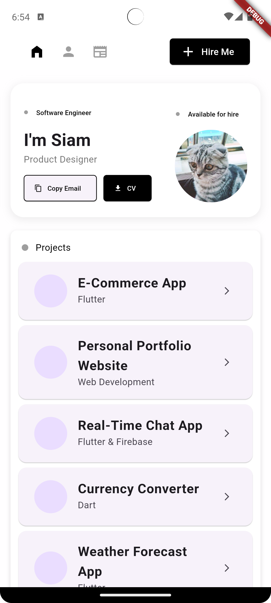
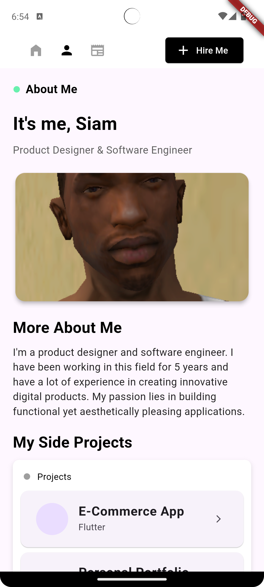
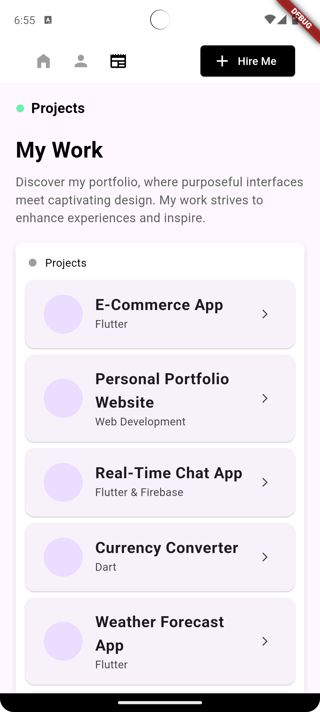

# 🌟 **Personal Portfolio App**

Welcome to my personal portfolio app! This **Flutter-based** application is designed to showcase my projects, skills, and achievements in a visually appealing and interactive way. Whether you're a potential employer, collaborator, or just curious about my work, this app will provide an in-depth look into what I can offer.

---

## 🚀 **Features**

- **🎯 Project Showcase**: Dive deep into the details of my projects, including:
  - Descriptions
  - Technologies used
  - Screenshots and media
- **⚙️ Skills Overview**: A comprehensive display of my proficiency in various skills and technologies.
- **💡 Interactive UI**: A clean, modern interface showcasing my ability to design and develop engaging user experiences.
- **📱 Responsive Design**: Seamlessly optimized for mobile and desktop platforms, ensuring an intuitive experience regardless of device.

---

## 📱 **Screenshots**

Explore some key sections of the app:

<div style="display: flex; justify-content: space-between;">
  
  
  
</div>

---

## 🛠️ **Technologies Used**

- **Flutter**: For building cross-platform mobile and web applications
- **Dart**: The programming language powering the app's business logic
- **Responsive Design**: Using Flutter's responsive layout capabilities for a consistent user experience across devices

---

## 🎯 **Future Plans**

- Add dark mode 🌙 support
- Integrate additional animations and transitions for enhanced user experience
- Expand the skills section with more interactive elements (e.g., progress bars, tooltips)
- Include a contact form with backend integration

---

## 🔗 **Get in Touch**

Feel free to reach out if you're interested in collaboration or have any feedback!

- [LinkedIn](https://www.linkedin.com/in/mdsiamulislamsoaib)
- [GitHub](https://github.com/mdsiamulislam)
- [Portfolio Website](https://sites.google.com/view/mdsiamulislamsoaib)

---

## 🛠️ **Installation & Setup**

1. Clone the repository:
   ```bash
   git clone https://github.com/mdsiamulislam/personal-portfolio-app.git
   ```
2. Navigate to the project directory:
   ```bash
   cd personal-portfolio-app
   ```
3. Install dependencies:
   ```bash
   flutter pub get
   ```
4. Run the app:
   ```bash
   flutter run
   ```

---

## 🏆 **Contributions**

Contributions are welcome! Feel free to open a pull request or file an issue if you notice anything that can be improved.

---
