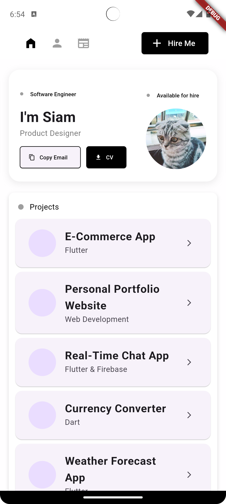
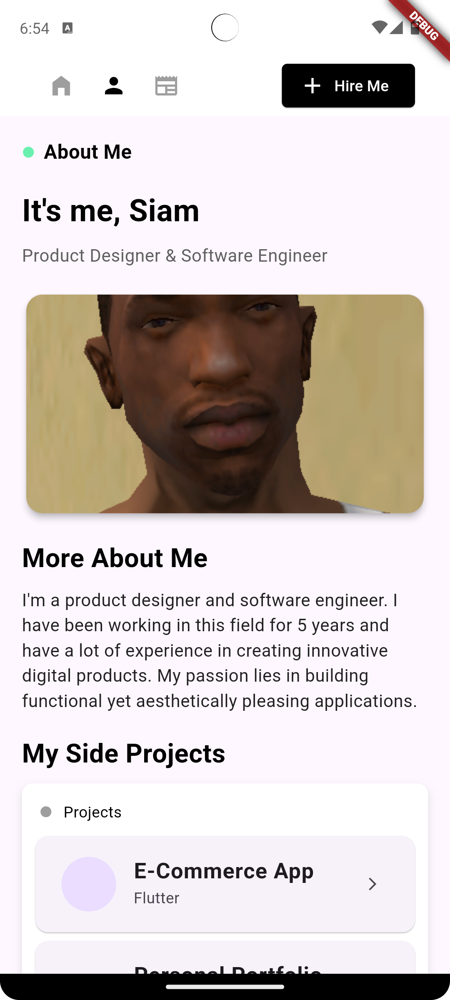
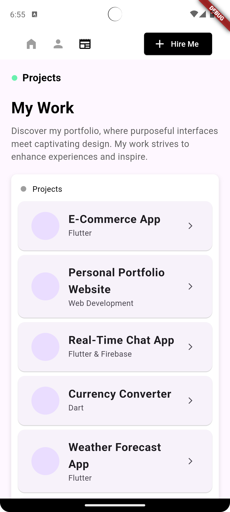

# Personal Portfolio App

Welcome to my personal portfolio app! This Flutter-based application showcases my projects, skills, and achievements. It provides a detailed view of my work and experience, making it easy for potential employers or collaborators to see what I have to offer.

## Features

- **Project Showcase**: Display detailed information about my projects, including descriptions, technologies used, and images.
- **Skills Overview**: Highlight the skills and technologies I am proficient in.
- **Interactive UI**: A modern and engaging user interface that showcases my design and development skills.
- **Responsive Design**: Optimized for both mobile and desktop platforms.

## Screenshots

Here are some screenshots of the application:

### Home Page

### About Me

### Project Details

